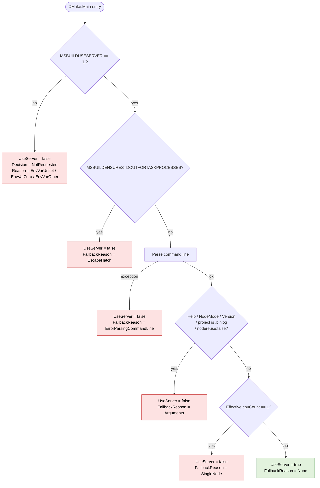

# MSBuild Server

MSBuild Server nodes accept build requests from clients and use worker nodes in the current fashion to build projects. The main purpose of the server node is to preserve caches between builds and avoid expensive MSBuild process start operations during build from tools like the .NET SDK.

## Usage

The primary ways to use MSBuild are via Visual Studio and via the CLI using the `dotnet build`/`dotnet msbuild` commands. MSBuild Server is not supported in Visual Studio because Visual Studio itself works like MSBuild Server. For the CLI, the server functionality is enabled by default and can be disabled by setting the `DOTNET_CLI_DO_NOT_USE_MSBUILD_SERVER` environment variable to value `1`.
To re-enable MSBuild Server, remove the variable or set its value to `0`.

When invoking `msbuild.exe` directly (outside the .NET SDK driver), opt in via the `MSBUILDUSESERVER` environment variable: set it to `1` to use the server, leave it unset or set it to `0` to run in-process.

### Eligibility decision

When the caller opts in via `MSBUILDUSESERVER=1`, the server is used only when the build is actually eligible for it. The decision is made once in `XMake.Main` by `MSBuildServerDecision.Decide` (see `src/MSBuild/CommandLine/MSBuildServerDecision.cs`). `BuildTelemetry.ServerFallbackReason` remains the coarse compatibility field; the `MSBuildServer*` telemetry fields record the request state, normalized configuration, decision reason, fallback stage, and final outcome.

**Fallback reasons:**

| Reason                    | Cause                                                                                  |
|---------------------------|----------------------------------------------------------------------------------------|
| `Arguments`               | `-help`, `-version`, `-nodemode`, binlog-as-project, or `-nodereuse:false` was passed. |
| `ErrorParsingCommandLine` | Command-line parsing threw an exception (e.g., invalid `-m:` value). The build will surface the parse error in-process. |
| `SingleNode`              | Effective `-m:1` (explicit `-m:1` or no `-m` switch). Server overhead is not justified for a single-node build. |
| `EscapeHatch`             | `MSBUILDENSURESTDOUTFORTASKPROCESSES=1` is set; the server cannot honour that contract. |

Note: the command-line parser rewrites a bare `-m` to `-m:<NumberOfCores>` before eligibility is decided, so `cpuCount == 1` truly means "single-node build was requested or `-m` was omitted entirely" (the latter is the default for `msbuild.exe` invoked directly by Visual Studio).

### Server telemetry

The server decision emits fields in layers so telemetry can answer "was the server requested?", "what configuration was considered?", "why did the decision go that way?", and "what ultimately happened after launch?"

| Field | Meaning |
|---|---|
| `MSBuildServerRequestState` | `Requested` when `MSBUILDUSESERVER=1`; otherwise `NotRequested`. |
| `MSBuildServerEnvVarValue` | Normalized `MSBUILDUSESERVER`: `Unset`, `0`, `1`, or `Other`. |
| `MSBuildServerEffectiveMaxNodeCount` | Parsed effective `-m` / `-maxcpucount` value, when command-line parsing reached that point. |
| `MSBuildServerNodeReuseEnabled` | Effective node reuse value, when command-line parsing reached that point. |
| `MSBuildServerProjectKind` | `Project`, `Solution`, `SolutionFilter`, `BinaryLog`, or `Unknown`. |
| `MSBuildServerStdOutEscapeHatchEnabled` | Whether `MSBUILDENSURESTDOUTFORTASKPROCESSES=1` affected the decision. |
| `MSBuildServerDecision` | `NotRequested`, `SkippedBeforeLaunch`, or `AttemptServer`. |
| `MSBuildServerDecisionReason` | Specific pre-launch reason: `EnvVarUnset`, `EnvVarZero`, `EnvVarOther`, `Eligible`, `EscapeHatch`, `Help`, `Version`, `NodeMode`, `BinaryLogReplay`, `NodeReuseDisabled`, `SingleNode`, or `ErrorParsingCommandLine`. |
| `MSBuildServerFallbackStage` | `PreLaunch` for eligibility fallbacks; `PostLaunch` for client/server failures. |
| `MSBuildServerFallbackDetailedReason` | The most specific fallback reason available: a pre-launch decision reason or a post-launch `MSBuildClientExitType`. |
| `MSBuildServerFinalOutcome` | `NotRequested`, `SkippedBeforeLaunch`, `AttemptServer`, `RanOnServer`, `FallbackToInProc`, or `ClientFailure`. |
| `MSBuildServerClientExitType` | `MSBuildClientExitType` reported by the client, for successful server runs and post-launch failures. |

## Communication protocol

The server node uses same IPC approach as current worker nodes - named pipes. This solution allows to reuse existing code. When process starts, pipe with deterministic name is opened and waiting for commands. Client has following worfklow:

1. Try to connect to server
   - If server is not running, start new instance
   - If server is busy or the connection is broken, fall back to previous build behavior
2. Initiate handshake
2. Issue build command with `ServerNodeBuildCommand` packet
3. Read packets from pipe
   - Write content to the appropriate output stream (respecting coloring) with the `ServerNodeConsoleWrite` packet
   - After the build completes, the `ServerNodeBuildResult` packet indicates the exit code

### Pipe name convention & handshake

There might be multiple server processes started with different architecture, associated user, MSBuild version and another options. To quickly identify the appropriate one, server uses convention that includes these options in the name of the pipe. Name has format `MSBuildServer-{hash}` where `{hash}` is a SHA256 hashed value identifying these options.

Handshake is a procedure ensuring that client is connecting to a compatible server instance. It uses same logic and security guarantees as current connection between entry node and worker nodes. Hash in the pipe name is basically hash of the handshake object.

### Packets for client-server communication

Server requires to introduce new packet types for IPC.

`ServerNodeBuildCommand` contains all of the information necessary for a server to run a build.

| Property name            | Type                         | Description |
|---|---|---|
| CommandLine              | String                       | The MSBuild command line with arguments for build |
| StartupDirectory         | String                       | The startup directory path |
| BuildProcessEnvironment  | IDictionary<String, String>  | Environment variables for current build |
| Culture                  | CultureInfo                  | The culture value for current build |
| UICulture                | CultureInfo                  | The UI culture value for current build |
| ConsoleConfiguration     | TargetConsoleConfiguration   | Console configuration of target Console at which the output will be rendered |

`ServerNodeConsoleWrite` contains information for console output.

| Property name            | Type          | Description |
|---|---|---|
| Text                     | String        | The text that is written to the output stream. It includes ANSI escape codes for formatting. |
| OutputType               | Byte          | Identification of the output stream (1 = standard output, 2 = error output) |

`ServerNodeBuildResult` indicates how the build finished.

| Property name            | Type          | Description |
|---|---|---|
| ExitCode                 | Int32         | The exit code of the build |
| ExitType                 | String        | The exit type of the build |

`ServerNodeBuildCancel` cancels the current build.

This type is intentionally empty and properties for build cancelation could be added in future.
